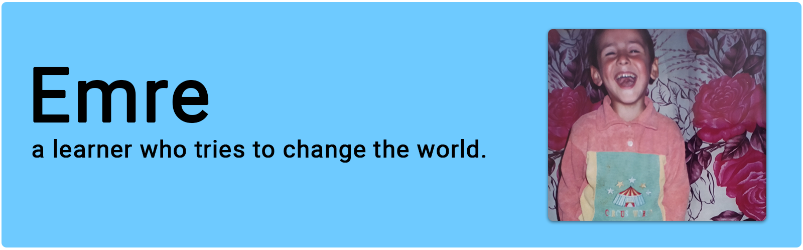

## Hi there! 👋

My name's Emre. I have recently completed a master's in the Department of CEIT at Amasya University 🇹🇷. My master thesis is focused on computational thinking 🔭. During the thesis term I try to develop the web app, which is a reliable and valid to measure high school students' computational thinking skills 🔬. Also I make scientific studies on computer science education 🔍.

| Project | Description | Technology |
| ------- | ----------- | ---------- |
|[Caption Meow](/caption-meow)|An open-source social network that provides a daily creative challenge for cat lovers to come up with witty captions for cat photos while competing with other users.|React, Firebase|
|[Twitter Note](/twitterNote)|A Chrome Extension that helps you to take notes about the people who you blocked, or muted.|JavaScript, chrome.storage API|
|[Türkçe Sözlük](/turkish-dictionary)|A digital platform that displays the meanings, properties, and usage of words in example sentences. The data source for the words included in the platform is sozluk.gov.tr.|React, JSON|
|[eksiShot](/eksiShot)|A free tool that converts entries on ekşi sözlük into images and takes screenshots of entry pages.|React, TailwindCSS, cheerio|
|[e-Devlet Favoriler](/e-devlet-fav)|A Chrome Extension that aims to save time for users of the Turkey e-Government Portal (turkiye.gov.tr) by allowing them to directly access their frequently used services from a list of favorite transactions, instead of having to search for them using the search box.|React, CRXJS, cheerio|
|[Realtime Location Tracker](/realtimeLocationTracker)|This is a real-time location tracking application developed using JS, Realtime Database, and Geolocation API.|JavaScript, Firebase, Google Maps API|
|[Dikey Geçiş Asistanı](/dikey-gecis-asistani)|An android app (native) to assist students preparing for the Dikey Gecis Sinavi (An exam in Turkey).|Java, Firebase|
|[Values Education](/values-education)|The project is a Content Management System for Values Education. As a teacher, you can add books and games for primary school students in the project. The students gain score through reading book, and then play games if the student's score is enough for the game.|Classic ASP, MS Access|
|[My Voice](/my-voice)|An Android app helps disabled people. The project's aim is to help disabled people to able to communicate more easily with people who do not know sign language.|Java, TextToSpeech|
|[3Words](/3Words)|A social network project, programmed in both Classic ASP and PHP. The first release was published in 2012. The users can write 3 words about themself on their profiles each other in 3Words.|Classic ASP, MS Access, PHP, MySQL|
|[Computational Thinking Score](/ComputationalThinking)|A web application that measures computational thinking skills, which are among the 21st century skills. This web application was also developed as a result of an academic investigation.|PHP, Bootstrap, MySQL|
|[Kuşadası Market](/kusadasi-market)|An e-commerce cart system that fetches products from an API and lists them on the page. Users can add products to their cart and also remove them from the cart.|JavaScript, Bootstrap|
|[Mentalist Theme](/Mentalist-Theme-Bootstrap)|Bootstrap theme for psychologists.|Bootstrap|
|[Lite Company Theme](/Lite-Company-Bootstrap-Theme)|Bootstrap theme for corporations.|Bootstrap|

  
Education

#### Amasya University (2018 to 2021)

- Computer Education and Instructional Technology
- Master of Science

#### Ondokuz Mayıs University (2016 to 2018)

- Computer Education and Instructional Technology
- Bachelor of Science

#### Ondokuz Mayıs University (2013 to 2015)

- Computer Programming
- Associate of Science

  
Skills

  
- Problem Solving
- Working as a part of a team
- Teaching

  
Hobbies

I live in Samsun, Turkey 🌿 and enjoy spending my free time reading scientific book & article and novel 📚, hanging out with friends as an asocial 🥂, learning new things about software development ✍️, watching TV series in English as my second language 📺, listening to loud music 🎶, and surfing on the internet 🌐.

Visit [my blog](https://emrecoban.github.io) for more.

<!--

**emrecoban/emrecoban** is a ✨ _special_ ✨ repository because its `README.md` (this file) appears on your GitHub profile.

Here are some ideas to get you started:

- 🔭 I’m currently working on ...
- 🌱 I’m currently learning ...
- 👯 I’m looking to collaborate on ...
- 🤔 I’m looking for help with ...
- 💬 Ask me about ...
- 📫 How to reach me: ...
- 😄 Pronouns: ...
- ⚡ Fun fact: ...
-->
